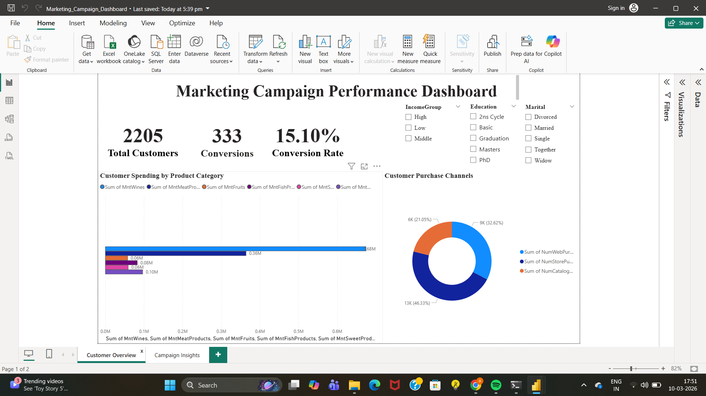
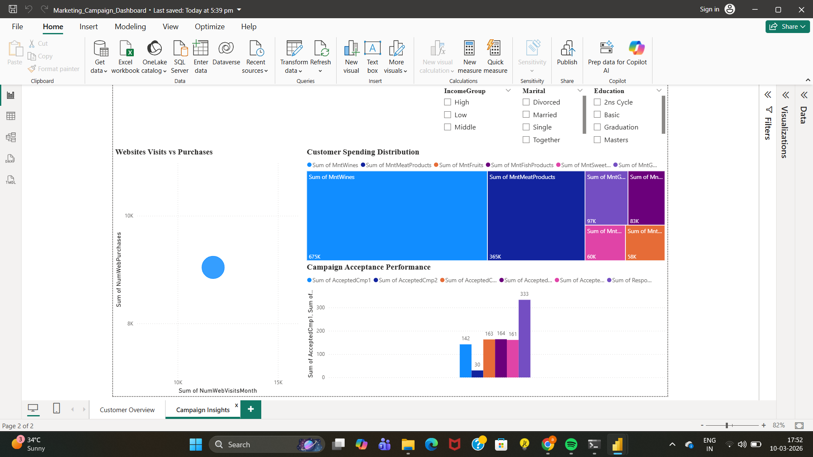

# marketing-campaign-analysis
End-to-end marketing campaign analysis using Python, SQL and Power BI.
# Marketing Campaign Analysis

This project analyzes customer behavior and marketing campaign performance using Python, SQL and Power BI.

## Tools Used
- Python (Data Cleaning)
- SQL (Data Analysis)
- Power BI (Dashboard)

## Key Insights
- Total Customers: 2205
- Total Conversions: 333
- Conversion Rate: 15.10%

### Customer Insights
- Wine products generate the highest customer spending.
- Web purchases dominate customer buying channels.

### Campaign Insights
- The final campaign achieved the highest conversion rate.
- Campaign 2 had the lowest acceptance among early campaigns.

## Dashboard
The Power BI dashboard provides interactive insights into:
- Customer spending behavior
- Purchase channels
- Campaign performance

## Dashboard Preview

### Customer Overview

### Campaign Insights

